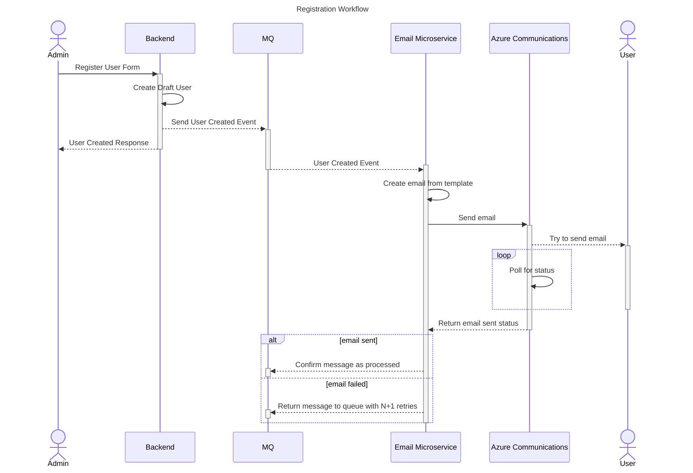

# backend

Main backend for inventory hub application

## Table of Contents

- [Setup](#setup)
  - [Docker](#docker)
  - [Local Development](#local-development)
- [Diagrams](#diagrams)
  - [White Space Analysis](#white-space-analysis)
  - [Registration Sequence Diagram](#registration-sequence-diagram)
- [Api Documentation](#api-documentation)
  - [/api/auth](#apiauth)
    - /api/auth/login [[POST](#apiauthlogin-post)]
    - /api/auth/invite [[POST](#apiauthinvite-post)]
    - /api/auth/refresh [[POST](#apiauthrefresh-post)]
    - /api/auth/register [[POST](#apiauthregister-post)]
  - [/api/users](#apiusers)
    - /api/users [[GET](#apiusers-get)]
    - /api/users/:id [[GET](#apiusersid-get), [PUT](#apiusersid-put), [DELETE](#apiusersid-delete)]
  - [/api/items/categories](#apiitemscategories)
    - /api/items/categories [[GET](#apiitemscategories-get), [POST](#apiitemscategories-post)]
    - /api/items/categories/:name [[DELETE](#apiitemscategoriesname-delete)]
  - [/api/items](#apiitems)
    - /api/items [[GET](#apiitems-get), [POST](#apiitems-post)]
    - /api/items/:id [[GET](#apiitemsid-get), [PUT](#apiitemsid-put), [DELETE](#apiitemsid-delete)]
    - /api/items/count/:id [[PATCH](#apiitemscountid-patch)]
  - [/api/items/transactions](#apiitemstransactions)
    - /api/items/transactions [[GET](#apiitemstransactions-get), [POST](#apiitemstransactions-post)]
    - /api/items/transactions/:id [[PUT](#apiitemstransactionsid-put), [DELETE](#apiitemstransactionsid-delete)]
    - /api/items/transactions/state/:id [[PATCH](#apiitemstransactionsstateid-patch)]

## Setup

### Docker

Install docker and docker-compose for your OS.

To start the services, run `docker-compose up -d` in the root directory.

To start the services and the backend, run `docker-compose --profile=server up -d --build` in the root directory.

### Local Development

Start the services with `docker-compose up -d` in the root directory.

Install Java XX and Maven XX.

...WIP

## Diagrams

### White Space Analysis


### Registration Sequence Diagram



## Api Documentation

The namespace structure for the api is the following:

```
/api
├── /auth
│   ├── /login [POST]
│   ├── /invite [POST]
|   ├── /refresh [POST]
│   └── /register [POST]
├── /users
│   ├── [GET]
│   └── /:id [GET, PUT, DELETE]
├── /items
|   ├── /categories
│   │   ├── [GET, POST]
│   │   └── /:name [DELETE]
|   ├── /transactions
│   │   ├── [GET, POST]
│   │   └── /state/:id [PATCH]
│   ├── [GET, POST]
│   ├── /:id [GET, PUT, DELETE]
│   └── /count/:id [PATCH]

```

### /api/auth

#### /api/auth/login [POST]

Login using credentials.

Authorization: Anonymous

Example payload:

```json
{
  "email": "admin@example.com",
  "password": "password"
}
```

Example success response:

```json
{
  "accessToken": "<jwt>",
  "refreshToken": "<refreshToken>"
}
```

Example error response (you can implement it differently if you want):

```json
{
  "errors": {
    "email": ["The email is not valid"]
  }
}
```

#### /api/auth/invite [POST]

Invite a user to the application.

Authorization: [Admin, Manager]

Example payload:

```json
{
  "email": "user@example.com",
  "firstName": "John",
  "lastName": "Doe",
  "role": "ReadonlyUser"
}
```

Example success response: 201 Created (empty body)

Example error response:

```json
{
  "errors": {
    "role": ["The role 'Blatnoi' is not valid"]
  }
}
```

#### /api/auth/refresh [POST]

Refresh JWT.

Authorization: Anonymous

Example payload:

old JWT in the authorization header

```json
{
  "refreshToken": "<refreshToken>"
}
```

Example success response:

```json
{
  "accessToken": "<jwt>",
  "refreshToken": "<refreshToken>"
}
```

#### /api/auth/register [POST]

Register a draft user.

Authorization: Anonymous

Example payload:

```json
{
  "token": "<invitationToken>",
  "username": "tolya_perforator1996",
  "password": "Tolya123!"
}
```

Example success response: 201 Created

```json
{
  "accessToken": "<jwt>",
  "refreshToken": "<refreshToken>"
}
```

Example error response:

```json
{
  "errors": {
    "token": ["The invitation token is not valid"]
  }
}
```

### /api/users

#### /api/users [GET]

Get the list of users with pagination, searching, maybe sorting (change the contract and add defaults) and minimal information required.

Authorization: Authorized (results show inferiors and peers)

Example query parameters:

```yaml
page: 1
pageSize: 10
search: "John"
```

Example success response:

```json
{
  "users": [
    {
      "id": "<id>",
      "firstName": "John",
      "lastName": "Admin",
      "role": "Admin"
    },
    {
      "id": "<id>",
      "firstName": "John",
      "lastName": "Doe",
      "role": "ReadonlyUser"
    }
  ],
  "totalPages": 1
}
```

Example error response:

```json
{
  "errors": {
    "page": ["The page must be a positive integer"]
  }
}
```

#### /api/users/:id [GET]

Get the user by id.

Authorization: Authorized (fails if the user is an inferior role)

Example success response:

```json
{
  "id": "<id>",
  "firstName": "John",
  "lastName": "Admin",
  "role": "Admin",
  "email": "john.admin@example.com"
}
```

Example error response:

```json
{
  "errors": {
    "id": ["The user with id '<id>' does not exist"]
  }
}
```

#### /api/users/:id [PUT]

Update the user by id.

Authorization: Authorized (fails if the user is an inferior or equal role)

Example payload:

```json
{
  "firstName": "John",
  "lastName": "Admin",
  "role": "Admin",
  "email": "johnny.admin@example.com"
}
```

Example success response: 204 No Content

Example error response:

```json
{
  "errors": {
    "id": ["The user with id '<id>' does not exist"],
    "role": ["The role 'BigBoss' is not valid"]
  }
}
```

#### /api/users/:id [DELETE]

Delete the user by id.

Authorization: Authorized (fails if the user is an inferior or equal role)

Example success response: 204 No Content

Example error response:

```json
{
  "errors": {
    "id": ["The user with id '<id>' does not exist"]
  }
}
```

### /api/items/categories

#### /api/items/categories [GET]

Get the list of categories available.

Authorization: Authorized

Example success response:

```json
{
  "categories": [
    {
      "name": "Electronics",
      "itemCount": 10
    },
    {
      "name": "Furniture",
      "itemCount": 5
    }
  ]
}
```

#### /api/items/categories [POST]

Create a new category.

Authorization: [Admin, Manager]

Example payload:

```json
{
  "name": "Electronics"
}
```

Example success response: 201 Created (empty body)

Example error response:

```json
{
  "errors": {
    "name": ["The category with name 'Electronics' already exists"]
  }
}
```

#### /api/items/categories/:name [DELETE]

Delete the category by name and all items in it.

Authorization: [Admin, Manager]

Example success response: 204 No Content

Example error response:

```json
{
  "errors": {
    "name": ["The category with name 'Electronics' does not exist"]
  }
}
```

### /api/items

#### /api/items [GET]

Get the list of items with pagination, searching, filtering and maybe sorting (change the contract and add defaults).

Authorization: Authorized

Example query parameters:

```yaml
page: 1
pageSize: 10
search: "iPhone"
category: "Electronics" # optional, defaults to all categories
```

Example success response:

> Note: decide if lockedQuantity should be normalized or de-normalized in the DB

```json
{
  "items": [
    {
      "id": "<id>",
      "name": "iPhone 12",
      "category": "Electronics",
      "quantity": 10,
      "lockedQuantity": 0,
      "description": "Better than iPhone 11 (maybe)",
      "imageUrl": "cdn.inventory-hub.space/uploads/items/iPhone12-<id>.png",
      "createdAt": "2021-01-01T00:00:00.000Z",
      "updatedAt": "2021-01-01T00:00:00.000Z"
    },
    {
      "id": "<id>",
      "name": "iPhone 11",
      "category": "Electronics",
      "quantity": 5,
      "lockedQuantity": 1,
      "imageUrl": null,
      "description": "Better than iPhone 10",
      "createdAt": "2021-01-01T00:00:00.000Z",
      "updatedAt": "2021-01-01T00:00:00.000Z"
    }
  ]
}
```

Example error response:

```json
{
  "errors": {
    "page": ["The page must be a positive integer"],
    "category": ["The category with name 'Electronics' does not exist"]
  }
}
```

#### /api/items [POST]

Create a new item.

Authorization: [Admin, Manager, User]

Example payload (form data):

```yml
name: iPhone 12
category: Electronics
quantity: 10
description: Better than iPhone 11 (maybe)
image: <binary data> | null
```

> Note: if implementing form data is too difficult, use JSON instead and the image will be encoded in base64

Example success response: 201 Created

```json
{
  "id": "<id>",
  "name": "iPhone 12",
  "category": "Electronics",
  "quantity": 10,
  "lockedQuantity": 0,
  "imageUrl": "cdn.inventory-hub.space/uploads/items/iPhone12-<id>.png",
  "description": "Better than iPhone 11 (maybe)",
  "createdAt": "2021-01-01T00:00:00.000Z",
  "updatedAt": "2021-01-01T00:00:00.000Z"
}
```

Example error response:

```json
{
  "errors": {
    "category": ["The category with name 'Electronics' does not exist"]
  }
}
```

#### /api/items/:id [GET]

Get the item by id.

Authorization: Authorized

Example success response:

```json
{
  "id": "<id>",
  "name": "iPhone 12",
  "category": "Electronics",
  "quantity": 10,
  "lockedQuantity": 0,
  "imageUrl": "cdn.inventory-hub.space/uploads/items/iPhone12-<id>.png",
  "description": "Better than iPhone 11 (maybe)",
  "createdAt": "2021-01-01T00:00:00.000Z",
  "updatedAt": "2021-01-01T00:00:00.000Z"
}
```

Example error response:

```json
{
  "errors": {
    "id": ["The item with id '<id>' does not exist"]
  }
}
```

#### /api/items/:id [PUT]

Update the item by id.

Authorization: [Admin, Manager, User]

Example payload (form data):

```yml
name: iPhone 12
category: Electronics
quantity: 10
description: Better than iPhone 11 (maybe)
image: <binary data> | null
```

> Note: if implementing form data is too difficult, use JSON instead and the image will be encoded in base64

Example success response: 200 OK

```json
{
  "id": "<id>",
  "name": "iPhone 12",
  "category": "Electronics",
  "quantity": 10,
  "lockedQuantity": 0,
  "imageUrl": "cdn.inventory-hub.space/uploads/items/iPhone12-<id>.png",
  "description": "Better than iPhone 11 (maybe)",
  "createdAt": "2021-01-01T00:00:00.000Z",
  "updatedAt": "2023-01-01T00:00:00.000Z"
}
```

Example error response:

```json
{
  "errors": {
    "id": ["The item with id '<id>' does not exist"],
    "category": ["The category with name 'Electronics' does not exist"]
  }
}
```

#### /api/items/:id [DELETE]

Delete the item by id.

Authorization: [Admin, Manager]

Example success response: 204 No Content

Example error response:

```json
{
  "errors": {
    "id": ["The item with id '<id>' does not exist"]
  }
}
```

#### /api/items/count/:id [PATCH]

Update the item quantity by id.

Authorization: [Admin, Manager, User]

Example payload:

```json
{
  "quantity": 11
}
```

Example success response: 200 OK

```json
{
  "id": "<id>",
  "name": "iPhone 12",
  "category": "Electronics",
  "quantity": 11,
  "imageUrl": "cdn.inventory-hub.space/uploads/items/iPhone12-<id>.png",
  "description": "Better than iPhone 11 (maybe)",
  "createdAt": "2021-01-01T00:00:00.000Z",
  "updatedAt": "2023-01-01T00:00:00.000Z"
}
```

Example error response:

```json
{
  "errors": {
    "quantity": ["The quantity must be a positive integer"]
  }
}
```

### /api/items/transactions

#### /api/items/transactions [GET]

Get the list of transactions with pagination, searching, filtering and maybe sorting (change the contract and add defaults).

Authorization: Authorized

Example query parameters:

```yaml
page: 1
pageSize: 10
search: "iPhone"
category: "Electronics" # optional, defaults to all categories
```

Example success response:

```json
{
  "transactions": [
    {
      "id": "<transactionId>",
      "client": "John Doe Enterprises",
      "description": "Will buy 5 IPhones in lease",
      "count": 5,
      "state": "Draft",
      "createdAt": "2021-01-01T00:00:00.000Z",
      "updatedAt": "2021-01-01T00:00:00.000Z",
      "item": {
        "id": "<itemId>",
        "name": "iPhone 12",
        "category": "Electronics",
        "quantity": 10,
        "lockedQuantity": 0,
        "imageUrl": "cdn.inventory-hub.space/uploads/items/iPhone12-<id>.png",
        "description": "Better than iPhone 11 (maybe)",
        "createdAt": "2021-01-01T00:00:00.000Z",
        "updatedAt": "2021-01-01T00:00:00.000Z"
      }
    },
    {
      "id": "<transactionId>",
      "client": "Main Office Floor 4",
      "description": "",
      "count": 12,
      "state": "Pending",
      "createdAt": "2021-01-01T00:00:00.000Z",
      "updatedAt": "2021-02-01T00:00:00.000Z",
      "item": {
        "id": "<itemId>",
        "name": "Toilet Paper",
        "category": "Hygiene",
        "quantity": 100,
        "lockedQuantity": 12,
        "imageUrl": null,
        "description": "",
        "createdAt": "2021-01-01T00:00:00.000Z",
        "updatedAt": "2021-02-01T00:00:00.000Z"
      }
    }
  ],
  "totalPages": 1
}
```

Example error response:

```json
{
  "errors": {
    "page": ["The page must be a positive integer"]
  }
}
```

#### /api/items/transactions [POST]

Create a new transaction.

Authorization: [Admin, Manager, User]

Example payload:

```json
{
  "itemId": "<itemId>",
  "client": "John Doe Enterprises",
  "description": "Will buy 5 IPhones in lease",
  "count": 5,
  "initialState": "Pending"
}
```

Example success response:

```json
{
  "id": "<transactionId>",
  "client": "John Doe Enterprises",
  "description": "Will buy 5 IPhones in lease",
  "count": 5,
  "state": "Pending",
  "createdAt": "2021-01-01T00:00:00.000Z",
  "updatedAt": "2021-01-01T00:00:00.000Z",
  "item": {
    "id": "<itemId>",
    "name": "iPhone 12",
    "category": "Electronics",
    "quantity": 10,
    "lockedQuantity": 5,
    "imageUrl": "cdn.inventory-hub.space/uploads/items/iPhone12-<id>.png",
    "description": "Better than iPhone 11 (maybe)",
    "createdAt": "2021-01-01T00:00:00.000Z",
    "updatedAt": "2021-01-01T00:00:00.000Z"
  }
}
```

Example error response:

```json
{
  "errors": {
    "initialState": ["The state 'Completed' cannot be an initial state"]
  }
}
```

#### /api/items/transactions/:id [PUT]

Update the transaction by id.

Authorization: [Admin, Manager]

Example payload:

```json
{
  "client": "John Doe Enterprises Incorporated",
  "description": "Will buy 5 IPhones in lease",
  "count": 6
}
```

Example response:

```json
{
  "id": "<transactionId>",
  "client": "John Doe Enterprises Incorporated",
  "description": "Will buy 5 IPhones in lease",
  "count": 6,
  "state": "Pending",
  "createdAt": "2021-01-01T00:00:00.000Z",
  "updatedAt": "2021-01-01T00:00:00.000Z",
  "item": {
    "id": "<itemId>",
    "name": "iPhone 12",
    "category": "Electronics",
    "quantity": 10,
    "lockedQuantity": 6,
    "imageUrl": "cdn.inventory-hub.space/uploads/items/iPhone12-<id>.png",
    "description": "Better than iPhone 11 (maybe)",
    "createdAt": "2021-01-01T00:00:00.000Z",
    "updatedAt": "2021-01-01T00:00:00.000Z"
  }
}
```

Example error response:

```json
{
  "errors": {
    "count": [
      "You specified the count 11, but the item 'iPhone 12' has only 10 unit(s) available"
    ]
  }
}
```

#### /api/items/transactions/:id [DELETE]

Delete the transaction by id. Transactions should not be deleted, to be kept for historic record, but admins can still do that.

Authorization: [Admin]

Example success response: 204 No Content

Example error response: 401 Unauthorized

#### /api/items/transactions/state/:id [PATCH]

Update the transaction state by id.

Authorization: [Admin, Manager]

Example payload:

```json
{
  "transition": "Completed"
}
```

Example success response:

```json
{
  "id": "<transactionId>",
  "client": "John Doe Enterprises Incorporated",
  "description": "Will buy 5 IPhones in lease",
  "count": 6,
  "state": "Completed",
  "createdAt": "2021-01-01T00:00:00.000Z",
  "updatedAt": "2021-01-01T00:00:00.000Z",
  "item": {
    "id": "<itemId>",
    "name": "iPhone 12",
    "category": "Electronics",
    "quantity": 4,
    "lockedQuantity": 0,
    "imageUrl": "cdn.inventory-hub.space/uploads/items/iPhone12-<id>.png",
    "description": "Better than iPhone 11 (maybe)",
    "createdAt": "2021-01-01T00:00:00.000Z",
    "updatedAt": "2021-01-01T00:00:00.000Z"
  }
}
```

Example error response:

```json
{
  "errors": {
    "transition": [
      "The transaction cannot go from the state 'Draft' to the state 'Completed'"
    ]
  }
}
```
