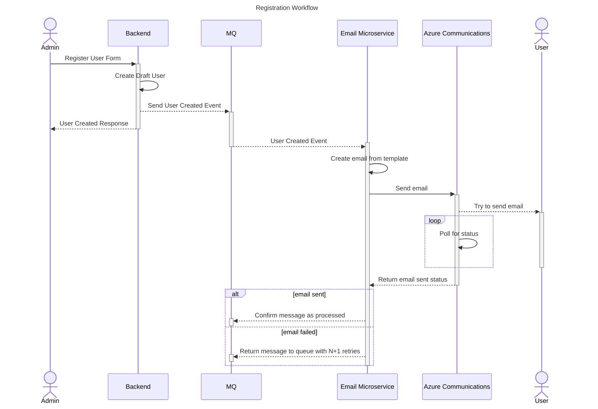

# backend

Main backend for inventory hub application

## Setup

### Docker

Install docker and docker-compose for your OS.

To start the services, run `docker-compose up -d` in the root directory.

To start the services and the backend, run `docker-compose --profile=server up -d --build` in the root directory.

### Local Development

Start the services with `docker-compose up -d` in the root directory.

Install Java XX and Maven XX.

...WIP

## Diagrams

### Registration Sequence Diagram

