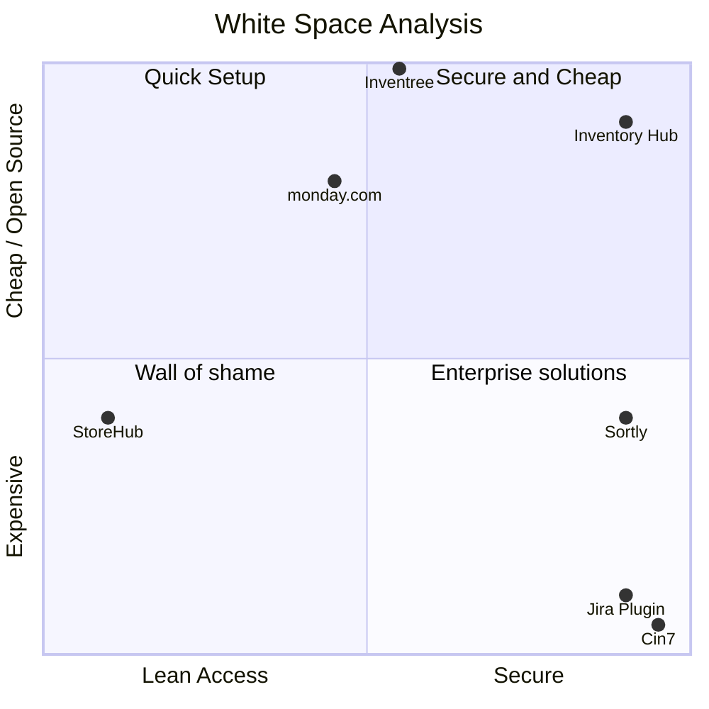
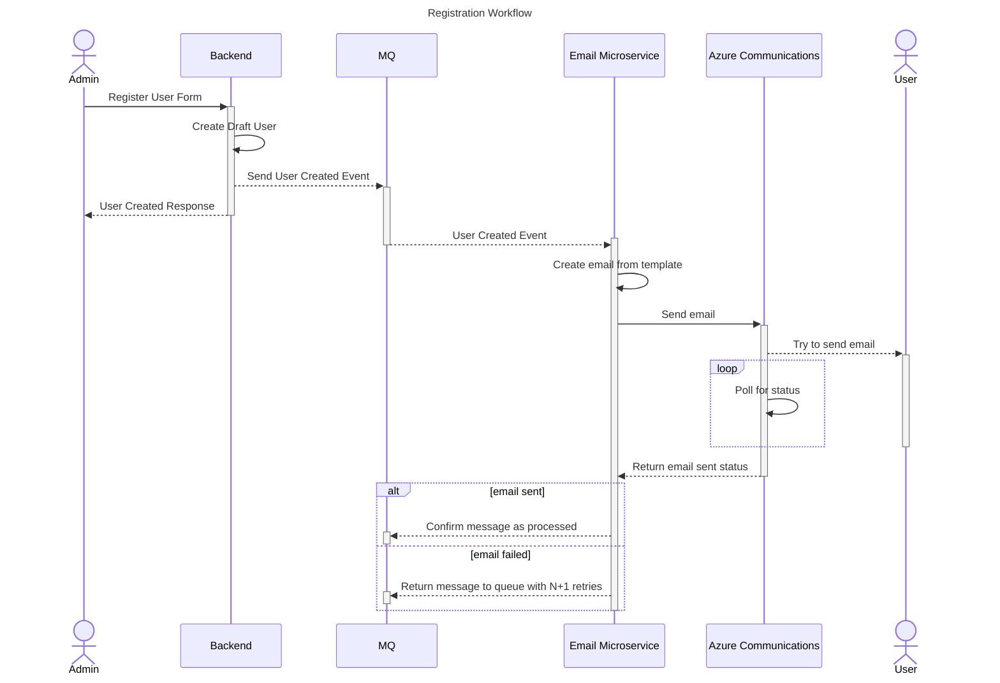

# backend

Main backend for inventory hub application

## Table of Contents

- [Setup](#setup)
  - [Docker](#docker)
  - [Local Development](#local-development)
- [Diagrams](#diagrams)
  - [White Space Analysis](#white-space-analysis)
  - [Registration Sequence Diagram](#registration-sequence-diagram)
- [Api Documentation](#api-documentation)
  - [/api/auth](#apiauth)
    - [/api/auth/login [POST]](#apiauthlogin-post)
    - [/api/auth/invite [POST]](#apiauthinvite-post)
    - [/api/auth/refresh [POST]](#apiauthrefresh-post)
    - [/api/auth/register [POST]](#apiauthregister-post)

## Setup

### Docker

Install docker and docker-compose for your OS.

To start the services, run `docker-compose up -d` in the root directory.

To start the services and the backend, run `docker-compose --profile=server up -d --build` in the root directory.

### Local Development

Start the services with `docker-compose up -d` in the root directory.

Install Java XX and Maven XX.

...WIP

## Diagrams

### White Space Analysis



### Registration Sequence Diagram



## Api Documentation

The namespace structure for the api is the following:

```
/api
├── /auth
│   ├── /login [POST]
│   ├── /invite [POST]
|   ├── /refresh [POST]
│   └── /register [POST]
├── /users
```

### /api/auth

#### /api/auth/login [POST]

Login using credentials.

Authorization: Anonymous

Example payload:

```json
{
  "email": "admin@example.com",
  "password": "password"
}
```

Example success response:

```json
{
  "accessToken": "<jwt>",
  "refreshToken": "<refreshToken>"
}
```

Example error response (you can implement it differently if you want):

```json
{
  "errors": {
    "email": ["The email is not valid"]
  }
}
```

#### /api/auth/invite [POST]

Invite a user to the application.

Authorization: [Admin, Manager]

Example payload:

```json
{
  "email": "user@example.com",
  "firstName": "John",
  "lastName": "Doe",
  "role": "ReadonlyUser"
}
```

Example success response: 201 Created (empty body)

Example error response:

```json
{
  "errors": {
    "role": ["The role 'Blatnoi' is not valid"]
  }
}
```

#### /api/auth/refresh [POST]

Refresh JWT.

Authorization: Anonymous

Example payload:

old JWT in the authorization header

```json
{
  "refreshToken": "<refreshToken>"
}
```

Example success response:

```json
{
  "accessToken": "<jwt>",
  "refreshToken": "<refreshToken>"
}
```

#### /api/auth/register [POST]

Register a draft user.

Authorization: Anonymous

Example payload:

```json
{
  "token": "<invitationToken>",
  "username": "tolya_perforator1996",
  "password": "Tolya123!"
}
```

Example success response: 201 Created

```json
{
  "accessToken": "<jwt>",
  "refreshToken": "<refreshToken>"
}
```

Example error response:

```json
{
  "errors": {
    "token": ["The invitation token is not valid"]
  }
}
```
